# Sistemas Operativos y Redes 2: Trabajo Práctico Device-Drivers

## Modulo Hola Mundo

## Introducción

En este trabajo, se solicita elaborar un kernel module para un char device el cual imprima en el kernel lo que le escribamos. Despues se solicita modificar lo que nos devuelve para que se visualice al reves caracter por caracter.

Para la primera parte donde imprime lo que le escribimos se definieron los siguientes archivos de la siguiente manera:

### Codigo char_device.c
```c

#include <linux/module.h>
#include <linux/kernel.h>
#include <linux/fs.h>
#include <linux/uaccess.h> 

static int device_open (struct inode *, struct file *) ;
static int device_release (struct inode *, struct file *) ;
static ssize_t device_read (struct file *, char *, size_t , loff_t *) ;
static ssize_t device_write (struct file *, const char *, size_t , loff_t *);


#define Nombre_Dispositivo "CharDevice-SORII"
#define Tamanio_Buffer 80

static int Major;
static int Dispositivo_Abierto = 0;

static char msj[Tamanio_Buffer];
static char *msg_Ptr;

static struct file_operations fops = {
 .read = device_read,
 .write = device_write,
 .open = device_open,
 .release = device_release
};

int init_module(void){ 
    /* Constructor */
    Major = register_chrdev(0, Nombre_Dispositivo, &fops);
    if (Major < 0) {
        printk(KERN_ALERT "No se pudo registrar el dispositivo char con %d\n", Major);
        return Major;
    }
    printk(KERN_INFO "Device: Driver %s registrado \n",Nombre_Dispositivo);
    printk(KERN_INFO "Device: Se le a asignado el número %d.\n", Major);
    printk(KERN_INFO "Device: Para comunicarse con el driver, cree un archivo dev con: 'mknod /dev/%s c %d 0'.\n",Nombre_Dispositivo,Major);
    printk(KERN_INFO "Device: Prueba varios números menores. Prueba hacer un cat y echo en el archivo del dispositivo.\n");
    printk(KERN_INFO "Device: Elimine el archivo del dispositivo y el modulo cuando haya terminado.\n");
    return 0;
}

void cleanup_module(void){ 
    /* Destructor */
    unregister_chrdev(Major, Nombre_Dispositivo);
    printk ( KERN_INFO "Device: Driver desregistrado \n");
}

static int device_open(struct inode *inode, struct file *file){
    if (Dispositivo_Abierto) return -EBUSY;
    Dispositivo_Abierto++;
    try_module_get(THIS_MODULE);
    return 0;
}

static int device_release(struct inode *inode, struct file *file){
    Dispositivo_Abierto--; 
    module_put(THIS_MODULE);
    return 0;
}

static ssize_t device_read(struct file *filp, char *buffer, size_t length, loff_t * offset){
    int bytes_read = 0;
    if (*msg_Ptr == 0)return 0;
    while (length && *msg_Ptr) {
        put_user(*(msg_Ptr++), buffer++);
        length--;
        bytes_read++;
    }
    return bytes_read;

}

static ssize_t device_write(struct file *filp, const char *buff, size_t len, loff_t * off){

   int i;
   #ifdef DEBUG
        printk(KERN_INFO "device_write(%p,%s,%d)",filp,buff,len);
   #endif
    for(i=0;i<len && i<Tamanio_Buffer;i++)get_user(msj[i],buff+i);

    msg_Ptr = msj;
    return i;
}


MODULE_LICENSE("GPL");
MODULE_AUTHOR("Argel Erik");
MODULE_DESCRIPTION("Un driver para el tp de SOR II");


```

### Codigo Makefile

```shell

obj-m := char_device.o

all:
	make -C /lib/modules/$(shell uname -r)/build M=$(PWD) modules
clean:
	make -C /lib/modules/$(shell uname -r)/build M=$(PWD) clean
  
```

Carpeta char_device:


Para compilara el codigo de nuestro device se utilizara el comando:

```shell
make clean & make
```
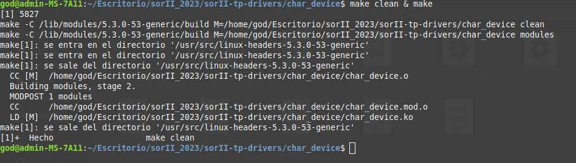

Resultado del comando anterior:

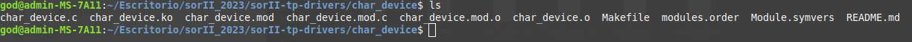

Ahora para cargar el modulo al kernel se utilizara el comando:

```shell
insmod char_device.ko
```
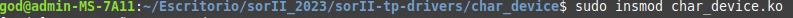

Luego utilizando el comando:

```shell
dmesg
```

Se puede apreciar los mensajes del nucleo (kernel), y al final de estos los generado al cargar el modulo. En ellos indica el major number que le fue asignado y como debe hacer para comunicarse con él.

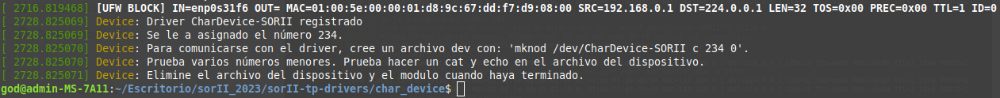

Se pasa a crear un archivo dev para comunicarse con el driver con el comando especificado en los mensajes anteriormente dados al cargar el modulo.

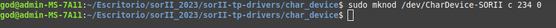

Se habilitaron todos los permisos para que no haya problemas despues.

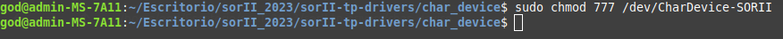

Aca se puede ver dos ejemplos de cominucación con el char device utilizando los comandos echo y cat.

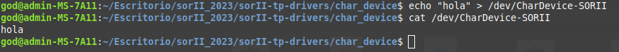

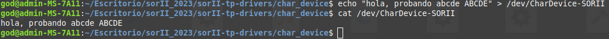

Utilizando el comando:

```shell
ls -la /dev
```

Se pueden ver todos los dispositivos, y entre ellos el char device recientemente creado.

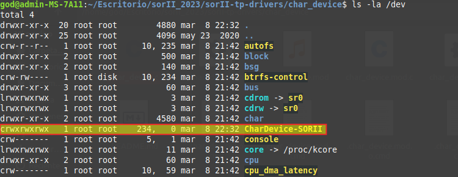

Por ultimo, para remover el modulo se utiliza el comando:

```shell
rmmod char_device.ko
```

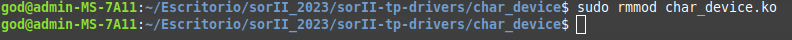

Y se puede ver con el comando:

```shell
dmesg
```

como se desregistra nuestro driver.

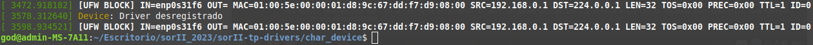
