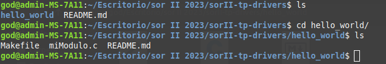
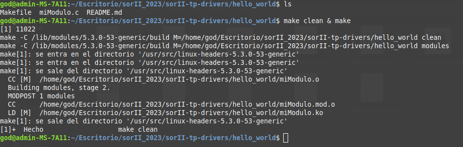
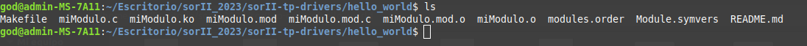
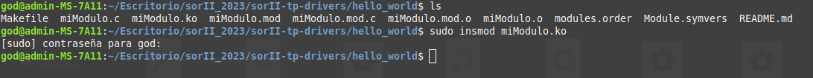
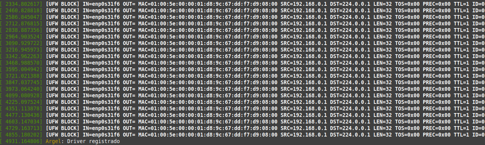
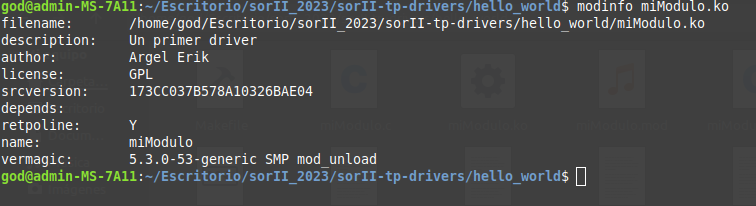
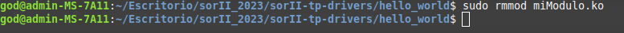
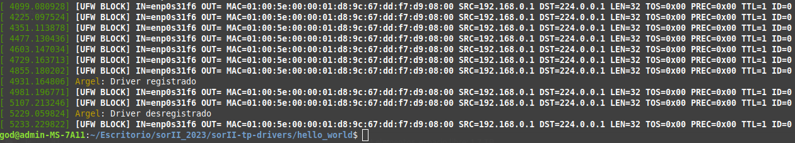

# Sistemas Operativos y Redes 2: Trabajo Práctico Device-Drivers

## Modulo Hola Mundo

## Introducción

En este trabajo, se crea un modulo de ejemplo basico se lo carga y descarga, y se toman algunas capturas de su funcionamiento.

### Codigo miModulo.c
```c

#include <linux/module.h>
#include <linux/kernel.h>

int init_module ( void )
{ /* Constructor */
printk ( KERN_INFO "Argel: Driver registrado \n") ;
return 0;
}
void cleanup_module ( void )
{/* Destructor */
printk ( KERN_INFO "Argel: Driver desregistrado \n") ;
}
MODULE_LICENSE ("GPL") ;
MODULE_AUTHOR ("Argel Erik") ;
MODULE_DESCRIPTION ("Un primer driver") ;


```
### Codigo Makefile

```shell

obj-m := miModulo.o

all:
		make -C /lib/modules/$(shell uname -r)/build M=$(PWD) modules

clean:
		make -C /lib/modules/$(shell uname -r)/build M=$(PWD) clean


```
Carpeta hello_world:



Para compilara el codigo de nuestro device se utilizara el comando:

```shell
make clean & make
```


Resultado del comando anterior:



Ahora para cargar el modulo al kernel se utilizara el comando:

```shell
insmod miModulo.ko
```


Luego utilizando el comando:

```shell
dmesg
```
Se puede apreciar los mensajes del nucleo (kernel), y al final de estos los generado al cargar el modulo. En este caso solo el mensaje de que el dirver se a registrado.



Luego utilizando el comando:

```shell
modinfo miModulo.ko
```
Se puede ver informacion sobre el modulo.



Por ultimo, para remover el modulo se utiliza el comando:

```shell
rmmod miModulo.ko
```


Y se puede ver con el comando:

```shell
dmesg
```

como se desregistra nuestro driver.


